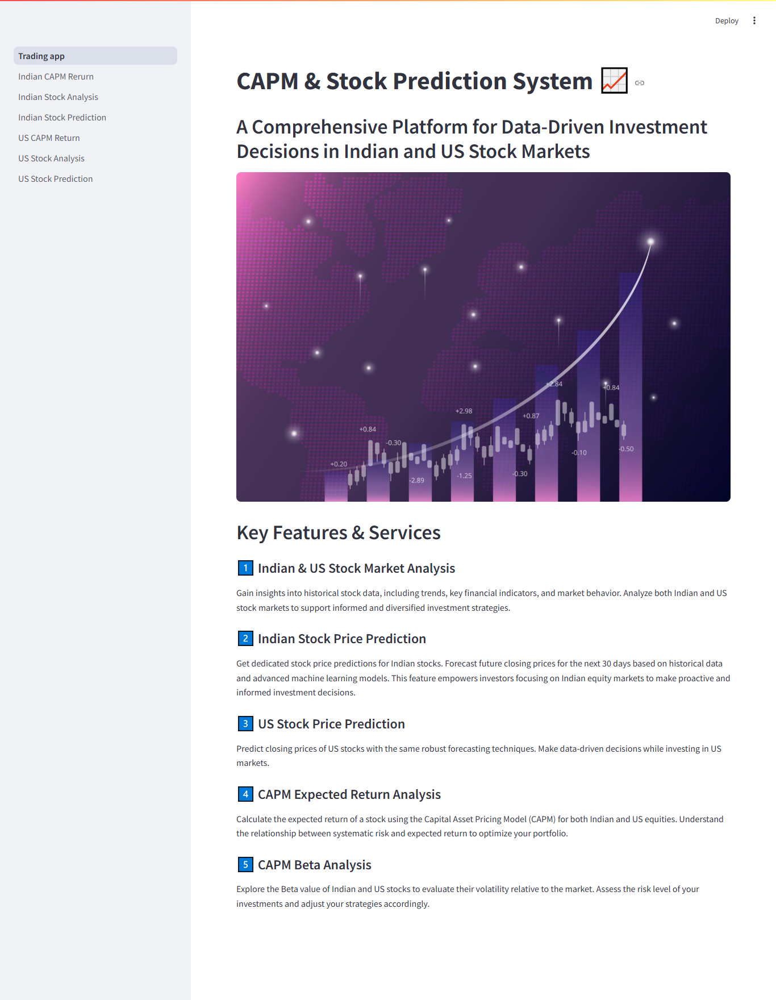

# CAPM & Stock Prediction System

**CAPM & Stock Prediction System** is a comprehensive data analysis and visualization platform built with **Streamlit**. It offers in-depth **CAPM Return Analysis**, **Stock Evaluation**, and **Stock Price Prediction** for both **Indian** and **US Stock Markets**.  
This tool helps investors and analysts make informed decisions by providing easy-to-use, data-driven insights.

---

## 📊 Features

- **CAPM Return Analysis**  
  Evaluate risk-adjusted returns for Indian and US stocks using the **Capital Asset Pricing Model (CAPM)**.

- **Stock Market Analysis**  
  Perform historical stock data analysis with key metrics and visualizations.

- **Stock Price Prediction**  
  Leverage machine learning models to forecast future stock prices for better investment decisions.

- **User-Friendly Interface**  
  Built with **Streamlit**, the application offers an intuitive interface for users to easily interact with the analysis tools.

---

## 🌐 Modules

- Indian CAPM Return  
- Indian Stock Analysis  
- Indian Stock Prediction  
- US CAPM Return  
- US Stock Analysis  
- US Stock Prediction

---

## 🛠️ Technologies Used

- Python 3.x  
- Streamlit  
- Pandas, NumPy  
- Matplotlib, Plotly, Seaborn  
- Scikit-learn  
- yFinance / Alpha Vantage APIs (if used)  
- CAPM and Regression Models

---

## 🚀 Installation & Setup

1. Clone the Repository
```bash
   git clone https://github.com/bidishacutex/Stock_Analysis.git
   cd Stock_Analysis
```

2. Install Dependencies
```bash
pip install -r requirements.txt
```
3. Run the Streamlit App
```bash
streamlit run Trading_app.py
```

---

## 📂 Project Structure

```bash
STOCK_ANALYSIS/
├── .devcontainer/                # Dev container configurations (optional)
├── pages/                        # Streamlit multipage directory
│   ├── utils/                    # Utility functions
│   │   ├── __init__.py
│   │   ├── model_train.py
│   │   ├── plotly_figure.py
│   ├── Indian_CAPM_Rerurn.py
│   ├── Indian_Stock_Analysis.py
│   ├── Indian_Stock_Prediction.py
│   ├── US_CAPM_Return.py
│   ├── US_Stock_Analysis.py
│   └── US_Stock_Prediction.py
├── __pycache__/                  # Cache files (auto-generated)
├── app.jpg                       # Image for app interface/banner
├── capm_functions_india.py       # India-specific CAPM functions
├── capm_functions.py             # General CAPM functions
├── README.md                     # Project documentation
├── requirements.txt              # Python dependencies
├── sources.txt                   # Data sources or references
├── stock_analysis.ipynb          # Jupyter notebook for stock analysis (optional)
└── Trading_app.py                # Main entry point (Streamlit app)
```

---

## 📈 Screenshots

| Home Page | Indian Stock Analysis |  
|-----------|----------------------|  
|  |  |  

---

## ✅ Future Enhancements

- Incorporate more advanced machine learning models (LSTM, ARIMA)  
- Add portfolio management features  
- Real-time data streaming for intraday analysis  
- User authentication and personalized dashboards  

---

## 📝 License

This project is licensed under the MIT License.

---

## 🙌 Acknowledgements

- Streamlit  
- yFinance  
- Alpha Vantage  
- Open-source contributors  
